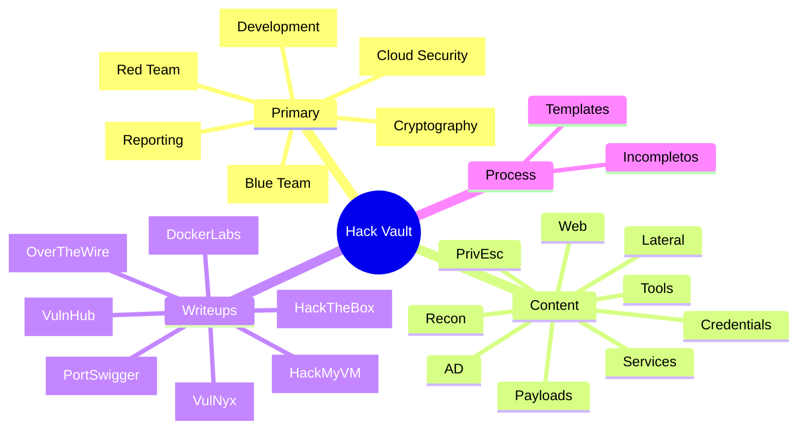

---
aliases:
  - Dashboard
  - Home
tags:
  - meta/index
cssclasses:
  - dashboard
---

# Global Index

Punto de entrada del vault. Navegación, métricas y trabajo en curso.

***

## Atajos

### Dashboards
- [[Incompletos]] — MOC pendientes por dominio
- [[Hack the Box]] — dashboard HTB

### Web
- [[Web Enumeración]] — MOC web recon
- [[Web Explotación]] — MOC web exploit

### Active Directory
- [[Active Directory]] — MOC AD
- [[Active Directory Enumeración]] — MOC AD enum
- [[Active Directory Explotación]] — MOC AD exploit

### Process
- [04 - Content/Process/](04%20-%20Content/Process/) — meta-notas y workflows

***

## Actividad Reciente

```dataview
TABLE WITHOUT ID
  file.link as "Nota",
  dateformat(file.mtime, "yyyy-MM-dd HH:mm") as "Modificada"
FROM ""
WHERE !contains(file.path, "00 - Resources/Templates")
SORT file.mtime DESC
LIMIT 15
```

***

## Incompletos — Teaser

> [!todo] 5 más recientes
> Ver lista completa en [[Incompletos]].

```dataview
TABLE WITHOUT ID
  file.link as "Nota",
  file.folder as "Carpeta"
FROM #estado/incompleto
WHERE !contains(file.path, "00 - Resources/Templates")
SORT file.mtime DESC
LIMIT 5
```

***

## Crear Nota Nueva

| Destino | Template | Atajo |
|---|---|---|
| Writeup HTB | `_hack the box` | [05 - Writeups/HackTheBox/](05%20-%20Writeups/HackTheBox/) |
| Writeup VulnHub | `_vulnhub` | [05 - Writeups/VulnHub/](05%20-%20Writeups/VulnHub/) |
| Writeup HackMyVM | `_hackmyvm` | [05 - Writeups/HackMyVM/](05%20-%20Writeups/HackMyVM/) |
| Cheatsheet | `_cheatsheet` | [04 - Content/](04%20-%20Content/) |
| Tool | `_tool` | [04 - Content/Tools/](04%20-%20Content/Tools/) |
| Technique | `_technique` | [04 - Content/](04%20-%20Content/) |
| Vulnerability | `_vulnerability` | [04 - Content/Web/](04%20-%20Content/Web/) |
| Sub-Note (3-col) | `_sub-note` | [04 - Content/](04%20-%20Content/) |
| Concept | `_concept` | [04 - Content/](04%20-%20Content/) |

Aplicar via `Templater: Insert Template` (Ctrl+Shift+P) o sobre nota recién creada.

***

## Writeups por Plataforma

```dataview
TABLE WITHOUT ID
  plataforma as "Plataforma",
  length(rows) as "Total",
  length(filter(rows, (r) => contains(r.file.tags, "estado/completo"))) as "✅",
  length(filter(rows, (r) => contains(r.file.tags, "estado/incompleto"))) as "🔴"
FROM "05 - Writeups"
FLATTEN split(file.folder, "/")[1] as plataforma
WHERE plataforma != null
GROUP BY plataforma
SORT length(rows) DESC
```

***

## Notas por Dominio (`asset/*`)

```dataview
TABLE WITHOUT ID
  regexreplace(dominio, "#asset/", "") as "Dominio",
  length(rows) as "Notas"
FROM ""
WHERE !contains(file.path, "00 - Resources/Templates")
FLATTEN filter(file.tags, (t) => startswith(t, "#asset/")) as dominio
GROUP BY dominio
SORT length(rows) DESC
```

***

## Notas por Tipo (`type/*`)

```dataview
TABLE WITHOUT ID
  regexreplace(tipo, "#type/", "") as "Tipo",
  length(rows) as "Notas"
FROM ""
WHERE !contains(file.path, "00 - Resources/Templates")
FLATTEN filter(file.tags, (t) => startswith(t, "#type/")) as tipo
GROUP BY tipo
SORT length(rows) DESC
```

***

## Notas por Carpeta (Top Level)

```dataview
TABLE WITHOUT ID
  carpeta as "Carpeta",
  length(rows) as "Notas"
FROM ""
WHERE !contains(file.path, "00 - Resources/Templates")
FLATTEN split(file.folder, "/")[0] as carpeta
GROUP BY carpeta
SORT length(rows) DESC
```

***

## Stats Generales

```dataview
TABLE WITHOUT ID
  length(rows) as "Total",
  length(filter(rows, (r) => contains(r.file.tags, "estado/completo"))) as "✅ Completo",
  length(filter(rows, (r) => contains(r.file.tags, "estado/incompleto"))) as "🔴 Incompleto",
  length(filter(rows, (r) => !contains(r.file.tags, "estado/completo") AND !contains(r.file.tags, "estado/incompleto"))) as "⚪ Sin estado"
FROM ""
WHERE !contains(file.path, "00 - Resources/Templates")
GROUP BY true
```

***

## Stale Notes (sin tocar > 90 días)

```dataview
TABLE WITHOUT ID
  file.link as "Nota",
  file.folder as "Carpeta",
  dateformat(file.mtime, "yyyy-MM-dd") as "Última edición"
FROM ""
WHERE !contains(file.path, "00 - Resources/Templates")
  AND (date(today) - file.mtime).days > 90
SORT file.mtime ASC
LIMIT 15
```

***

## Top 15 Tags

```dataview
TABLE WITHOUT ID
  tag as "Tag",
  length(rows) as "Uso"
FROM ""
WHERE !contains(file.path, "00 - Resources/Templates")
FLATTEN file.tags as tag
GROUP BY tag
SORT length(rows) DESC
LIMIT 15
```

***

## Templates Disponibles

```dataview
TABLE WITHOUT ID
  file.link as "Template",
  split(file.folder, "/")[2] as "Categoría"
FROM "00 - Resources/Templates"
SORT file.folder ASC, file.name ASC
```

***

## Mapa Mental



***

## Referencias

- [[Obsidian - Custom CSS]] — callouts custom (`[!flag]`, etc)
- [[Obsidian - Getting Started]] — onboarding
- [[Obsidian - Plugins]] — plugins instalados
- [[Vault Structure and Note Creation]] — convenciones
