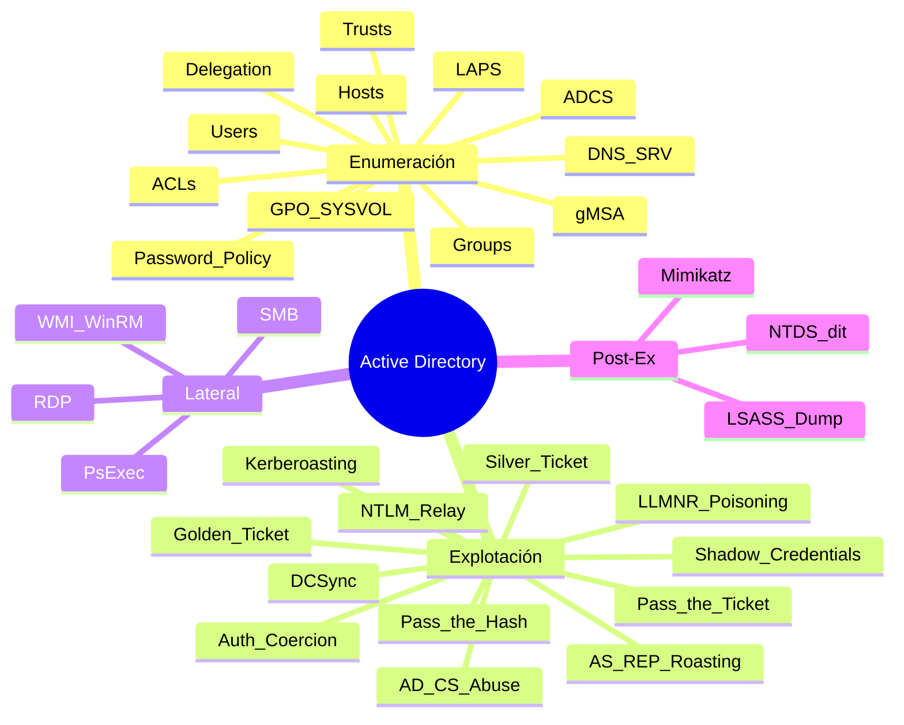

---
aliases:
tags:
primary categories:
  - "[[Red Team]]"
kind: Secondary Category
---
# Active Directory

***

## Mapa Mental

***

## [[Active Directory Enumeración]]

***

## [[Active Directory Explotación]]

***

## [[Windows & Active Directory Lateral Movement]]

***
