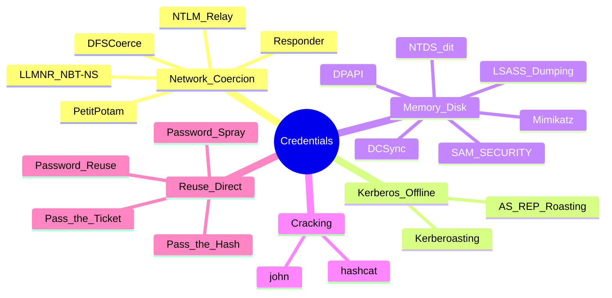

---
aliases:
  - Credential Access
tags:
  - technique/credential-access
primary categories:
  - "[[Red Team]]"
kind: Secondary Category
---
# [[Credential Harvesting]]

***

## Mapa Mental

***

## Overview

Extracción y captura de credenciales — hashes, tickets, cleartext, tokens — para cracking offline, reuso directo (PtH/PtT), o escalación.

***

## 1. Network coercion / poisoning

- [[LLMNR & NBT-NS Poisoning]] — Responder/Inveigh/mitm6 → NetNTLMv2.
- [[Responder]] — listener principal LLMNR/NBT-NS/mDNS/WPAD.
- [[NTLM Relay]] — relay NTLMv2 a SMB/LDAP/HTTP.
- [[Authentication Coercion]] — PetitPotam, PrinterBug, DFSCoerce, ShadowCoerce.

## 2. Kerberos offline

- [[Kerberoasting]] — TGS de SPN accounts → crack offline (hashcat `-m 13100`).
- [[AS-REP Roasting]] — AS-REP de `DONT_REQ_PREAUTH` users (hashcat `-m 18200`).

## 3. Memory / disk extraction

- [[Secret Dumping]] — umbrella: DCSync, SAM/SECURITY/SYSTEM, NTDS.dit, LSASS, DPAPI.
- [[LSASS Dumping]] — in-memory tickets + cleartext.
- [[DCSync]] — replication API → todos hashes domain.
- [[Mimikatz Cheatsheet]] — tool de referencia.

## 4. Cracking

- [[hashcat]] — modes 1000 (NTLM), 5600 (NetNTLMv2), 13100 (TGS), 18200 (AS-REP), 2100 (DCC2).

## 5. Reuso directo

- [[Pass-the-Hash]] — NT hash → SMB/WMI/PsExec.
- [[Pass-the-Ticket]] — ccache/kirbi → ticket injection.

***
