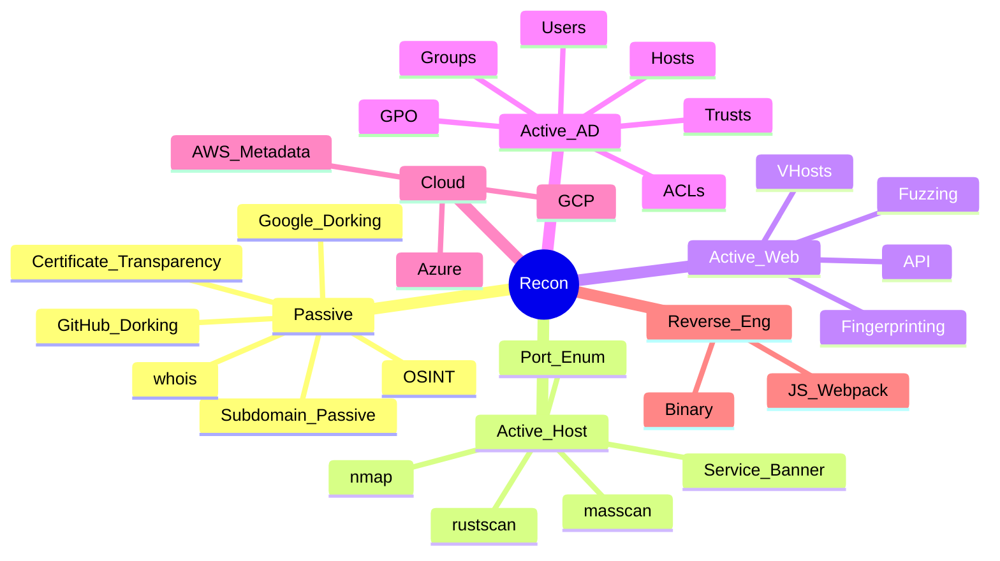

---
aliases:
  - "Enumeration"
  - Recopilación de información
tags:
  - type/moc/secondary
primary categories:
  - "[[Red Team]]"
kind: Secondary Category
---
# Recopilación de Información

***

## Mapa Mental

***

## 🖥️[[Active Directory Enumeración]]

***

## 🌿[[Passive Reconnaissance & OSINT]]

***

## 🌐[[Web Enumeración]]

***

## 📩[[Host & Network Enumeration]]

***

## ☁️[[Cloud Enumeration]]

***

## ⚕️[[Reverse Engineering]]

***
