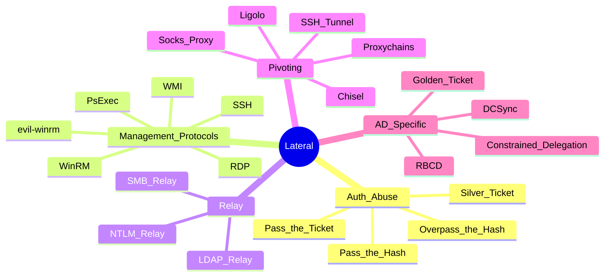

---
aliases:
  - Movimiento Lateral
tags:
primary categories:
  - "[[Red Team]]"
kind: Secondary Category
---
# Movimiento Lateral

---

## Mapa Mental

---

## [[Windows & Active Directory Movimiento Lateral]]

---

## Vectores específicos

- [[WMI and WinRM]] — management-blessed lateral movement (wmiexec, evil-winrm, PS Remoting).
- [[Pass-the-Hash]] — NT hash → SMB/WMI/WinRM sin password.
- [[Pass-the-Ticket]] — Kerberos ticket injection.
- [[evil-winrm]] — cliente Ruby WinRM con Invoke-Binary.

---

## [[Pivoting & Port Forwarding]]

---
