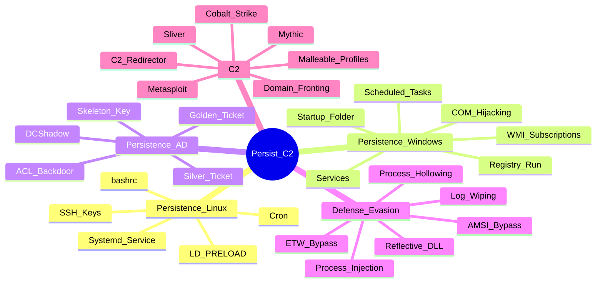

---
aliases:
tags:
primary categories:
  - "[[Red Team]]"
kind: Secondary Category
---
# Persistence, Defense Evasion & C2

---

## Mapa Mental

---

## [[Persistence Techniques]]

---

## [[Defense Evasion]]

---

## [[Command & Control (C2)]]

---
