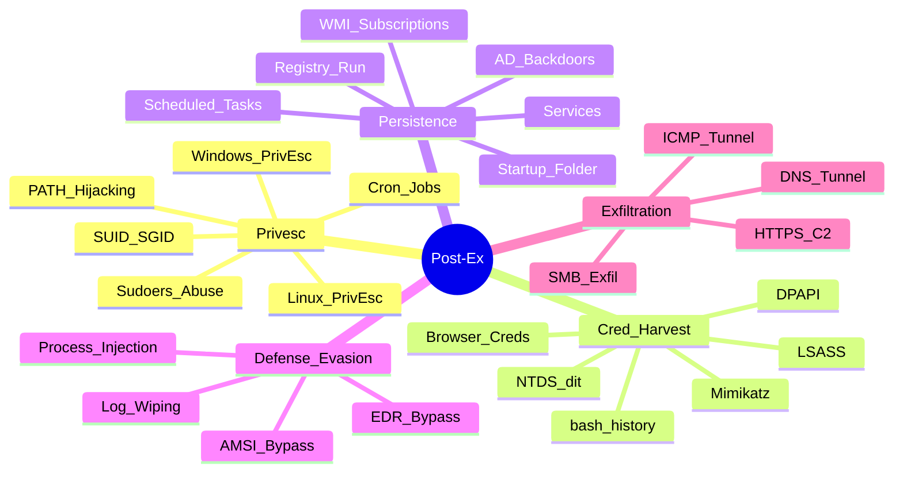

---
aliases:
tags:
  - type/moc/secondary
primary categories:
  - "[[Red Team]]"
kind: Secondary Category
---
# Post-Exploitation

***

## Mapa Mental

***

## [[Linux Post-Explotación]]

***

## [[Windows Post-Explotación]]

***

