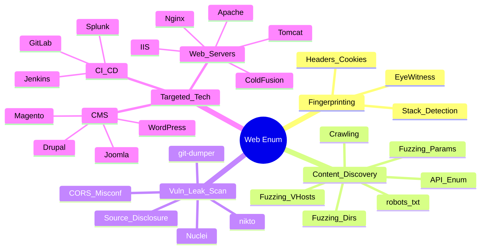

---
aliases:
  - "Web Enumeration"
  - Enumeración Web
tags:
  - technique/recon/active
  - asset/web-app
primary categories:
  - "[[Red Team]]"
secondary categories:
  - "[[Information Gathering]]"
  - "[[Web]]"
kind: Tertiary Category
---
# Enumeración Web

***

## Mapa Mental

***

## 🆔 Fingerprinting & Technology Analysis
  Identificación de tecnologías, frameworks y CMS utilizados.

- [[Fingerprinting Web Technologies]] (Detección del stack tecnológico: Wappalyzer, cabeceras, cookies.)
- [[Visual Reconnaissance with EyeWitness]] (Captura automatizada de capturas de pantalla para identificar servicios visualmente.)

## 🔍 Content Discovery & Fuzzing
  Búsqueda activa de directorios ocultos, archivos, parámetros y rutas virtuales.

- [[Fuzzing Directories & Pages]] (Descubrimiento de recursos ocultos mediante fuerza bruta.)
- [[Fuzzing Parameters & Values]] (Identificación de parámetros GET/POST ocultos para ampliar la superficie de ataque.)
- [[Fuzzing Subdomains & Virtual Hosts]] (Búsqueda activa de VHosts en el servidor web mediante cabeceras Host.)
- [[Crawling & Spidering]]] (Mapeo automático de la estructura del sitio siguiendo enlaces.)
       - [[robots.txt]] & [[Well-Known URIs]] (Revisión de archivos estándar que revelan rutas sensibles.)
 - [[API Enumeration]]
 - [[Cloud Enumeration for Web Assets]]`

## 🔓 Vulnerability & Leak Scanning
Búsqueda automatizada de fallos conocidos y exposiciones.

- [[Web Vulnerability Scanning]] (*[[nikto]], Nuclei.)
- [[Source Code Disclosure]] ([[git-dumper]], [[.ds_store]], backups)
- [[CORS Misconfiguration Enumeration]]

## 🎯 Targeted Technology Enumeration
  Metodologías específicas según el software detectado.

### CMS & Web Apps
- [[WordPress Enumeration]]
- [[Joomla Enumeration]]
- [[Drupal Enumeration]]
- [[Magento Enumeration]]
- [[osTicket Enumeration]]

### CI/CD & Management Tools
- [[Jenkins Enumeration]]
- [[GitLab Enumeration]]
- [[Splunk Enumeration]]
- [[PRTG Network Monitor Enumeration]]

###  Web Servers & Middleware
- [[IIS Enumeration]]
- [[Tomcat Enumeration]]
- [[ColdFusion Enumeration]]
- [[Nginx & Apache Enumeration]] (Enumeración específica para los servidores web más comunes.)

***