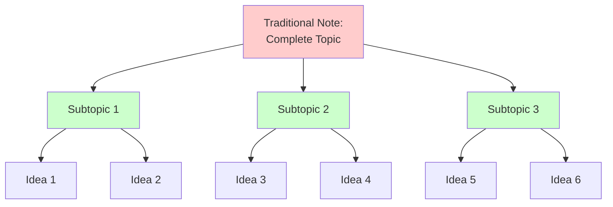

---
aliases:
tags:
  - idea
primary categories:
  - "[[Vault Administration]]"
secondary categories:
  - "[[Learning Techniques]]"
type: Idea
---
# [[Drawbacks of Traditional Note-Taking Systems]]

---

## Overview

Traditional note-taking systems follow a rigid hierarchical structure that creates significant barriers to knowledge discovery and creative thinking. As illustrated in the diagram below, these systems organize information in a top-down manner where complete topics branch into predetermined subtopics, which then contain individual ideas. This approach forces knowledge into artificial containers, making it difficult to recognize connections between ideas that exist across different hierarchical branches. When concepts are siloed within their respective categories, the natural web of relationships between ideas becomes invisible, limiting the potential for synthesis and innovation.

Hierarchical systems create retrieval bottlenecks as knowledge bases scale. Single-location storage wastes relevant information across multiple contexts. Restructuring becomes costly when understanding evolves, leading to outdated organizational schemes.

## Context/Background

This idea came to me as I was learning more about the [[Zettelkasten]] method and reading TrustedSec's blog post, *Obsidian, Taming a Collective Consciousness*[^1].

## Potential Applications

* An Obsidian vault implementation of the Zettelkasten note-taking system

## Next Steps

1. [x] Fork the Obsidian-Vault-Structure[^2] repository by TrustedSec
2. [x] Make personal edits to your detached fork repository
3. [ ] Make the repository public and collect feedback

---

## Resources

| Hyperlink                                                                                                                                                                                                                                                      | Info                                                                                                        |
| -------------------------------------------------------------------------------------------------------------------------------------------------------------------------------------------------------------------------------------------------------------- | ----------------------------------------------------------------------------------------------------------- |
| [The Zettelkasten Method, Abram Demski](https://www.lesswrong.com/posts/NfdHG6oHBJ8Qxc26s/the-zettelkasten-method-1)                                                                                                                                           | Flashcard implementation of Zettelkasten                                                                    |
| [Zettelkasten Method: How to Take Smart Notes For Knowledge Management, Disputant](https://disputant.medium.com/zettelkasten-method-how-to-take-smart-notes-for-knowledge-management-a66f636ede6c)                                                             | High-level overview of Zettelkasten and discussion of digital solutions                                     |
| [Zettelkasten -- How One German Scholar Was So Freakishly Productive, David B. Clear](https://web.archive.org/web/20200630040820/https://writingcooperative.com/zettelkasten-how-one-german-scholar-was-so-freakishly-productive-997e4e0ca125?gi=b6844ef2ec52) | High-level overview of Zettelkasten and discussion of digital and analog solutions(Wayback Machine Archive) |
| [Obsidian, Taming a Collective Consciousness; Sam Link](https://trustedsec.com/blog/obsidian-taming-a-collective-consciousness)                                                                                                                                | Example implementation of Zettelkasten using Obsidian                                                       |

[^1]: Obsidian, Taming a Collective Consciousness; Sam Link; https://trustedsec.com/blog/obsidian-taming-a-collective-consciousness
[^2]: Obsidian-Vault-Structure, TrustedSec, https://github.com/trustedsec/Obsidian-Vault-Structure

---

*Created Date*: <%+tp.file.creation_date("MMMM Do YYYY (HH:mm a)")%>  
*Last Modified Date*: <%+tp.file.last_modified_date("MMMM Do YYYY (HH:mm a)")%>
