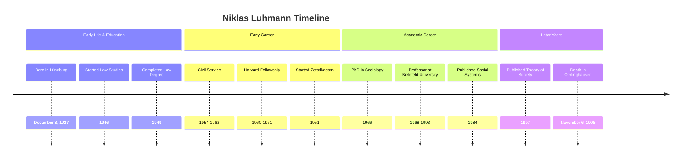

---
aliases:
tags:
  - biography
primary categories:
secondary categories:
type: Biography
---
# [[Niklas Luhmann]]

---

## Overview

![[Pasted image 20250813171510.png|300]]

Niklas Luhmann (1927–1998) was a German sociologist and key figure in systems theory. Originally trained in law, he shifted to sociology in the 1960s and became a professor at Bielefeld University. His work reframed society as a network of communications rather than a collection of individuals, with major contributions in works such as *Social Systems*[^1] and *Theory of Society*[^2][^3].

Luhmann wrote over 70 books and hundreds of articles on topics from law and politics to art and religion, often connecting ideas across disciplines. A major driver of his productivity was the [[Zettelkasten]] ("slip-box") technique, a system of tens of thousands of linked index cards, each containing a single idea or reference.

He described the Zettelkasten as a "secondary memory" that could engage in a dialogue with its user[^4]. By keeping [**atomic notes**](https://www.notedexapp.com/blog/atomic-notes) and linking them precisely, Luhmann explored complex topics non-linearly and developed ideas over decades without losing earlier insights.

The Zettelkasten method has since been adopted globally by academics, writers, and knowledge workers. While not the first to use such a system, Luhmann's disciplined approach and output made him the figure most closely associated with its modern form.

## Timeline

## Notable Works

| Title                         | Type | Year | Link / Reference          | Notes                               |
| ----------------------------- | ---- | ---- | ------------------------- | ----------------------------------- |
| Social Systems                | Book | 1984 | Stanford University Press | Foundational work on systems theory |
| Theory of Society (Vol. 1)    | Book | 1997 | Stanford University Press | Comprehensive social theory         |
| Theory of Society (Vol. 2)    | Book | 1997 | Stanford University Press | Continuation of social theory work  |
| Trust and Power               | Book | 1979 | Polity Press              | Analysis of social mechanisms       |
| The Reality of the Mass Media | Book | 1996 | Stanford University Press | Media theory and communication      |

## Legacy

Luhmann's systems theory provided a framework for understanding complex social phenomena that influenced fields from business administration to cybernetics. The concept of [autopoiesis](https://en.wikipedia.org/wiki/Autopoiesis) (self-creation) that he adapted from biology became central to understanding how social systems maintain and reproduce themselves.

Luhmann's Zettelkasten methodology has experienced renewed interest in the digital age, inspiring knowledge management systems and note-taking applications. Modern implementations like Obsidian, Roam Research[^5],  and Logseq[^6] draw directly from his principles of atomic notes and non-hierarchical linking. The productivity he achieved through this system (over 400 scholarly articles and 70 books) demonstrates the practical value of networked thinking for intellectual work.

---

## Resources

| Hyperlink                                                                 | Info                              |
| ------------------------------------------------------------------------- | --------------------------------- |
| [Niklas Luhmann, Wikipedia](https://en.wikipedia.org/wiki/Niklas_Luhmann) | Wikipedia page for Niklas Luhmann |
| [Zettelkasten, Wikipedia](https://en.wikipedia.org/wiki/Zettelkasten)     | Wikipedia page for Zettelkasten   |

[^1]: Social Systems, Niklas Luhmann, https://www.sup.org/books/sociology/social-systems
[^2]: Theory of Society Volume 1, Niklas Luhmann, https://www.sup.org/books/sociology/theory-society-volume-1
[^3]: Theory of Society Volume 2, Niklas Luhmann, https://www.sup.org/books/sociology/theory-society-volume-2
[^4]: Communicating with Slip Boxes, Niklas Luhmann, https://luhmann.surge.sh/communicating-with-slip-boxes
[^5]: Roam, Roam Research, https://roamresearch.com/
[^6]: Logseq, Logseq, https://github.com/logseq/logseq

---

*Created Date*: <%+tp.file.creation_date("MMMM Do YYYY (HH:mm a)")%>  
*Last Modified Date*: <%+tp.file.last_modified_date("MMMM Do YYYY (HH:mm a)")%>
