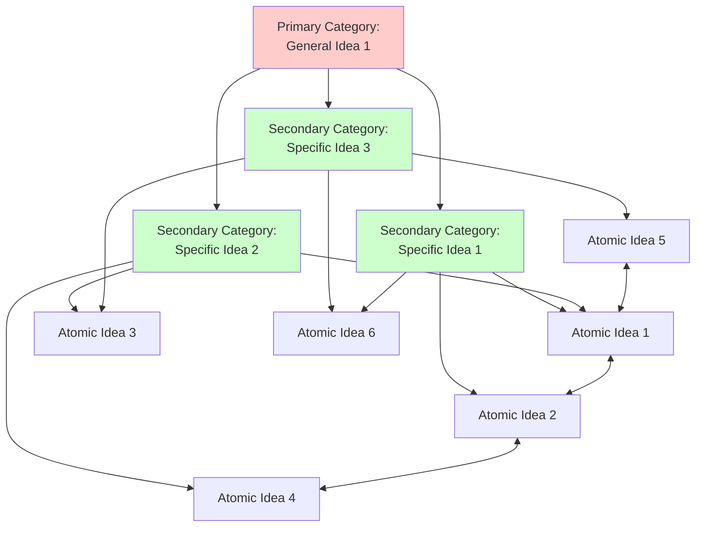
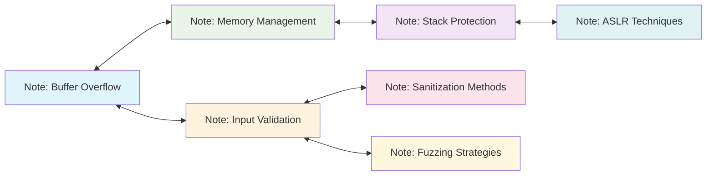
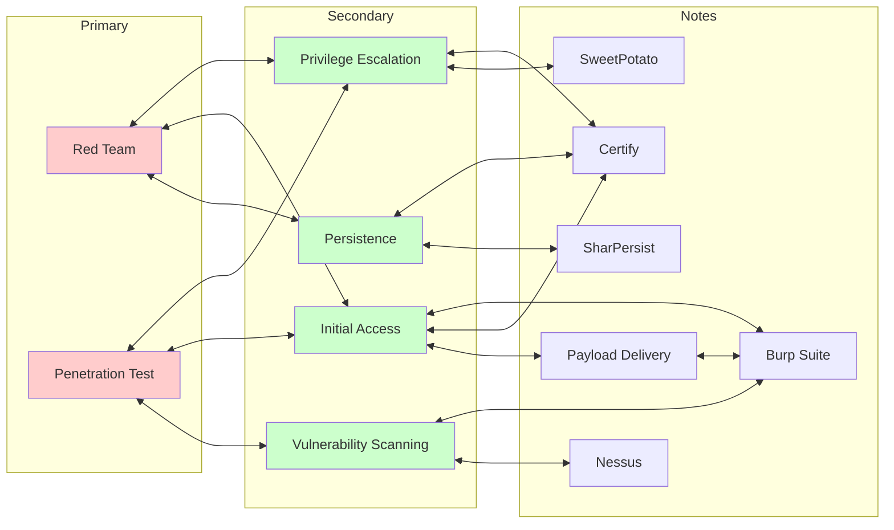

---
aliases:
  - Slip-Box
tags:
  - basic
primary categories:
  - "[[Training]]"
secondary categories:
  - "[[Learning Techniques]]"
type: Basic
---
# [[Zettelkasten]]

***

## Overview

[[Niklas Luhmann]]'s Zettelkasten (German for "slip-box") was a physical index-card system for managing [**atomic notes**](https://www.notedexapp.com/blog/atomic-notes) through unique identifiers and cross-references, enabling non-linear exploration that helped him produce prolific work. Unlike isolated flashcards, the Zettelkasten's strength lies in its network of interconnected notes — a concept modern tools like Obsidian replicate digitally using Markdown-linked notes. As highlighted in TrustedSec's blog post *Obsidian, Taming a Collective Consciousness*[^1], this approach can transform siloed documentation into a living, interconnected knowledge base that evolves continuously.

## Zettelkasten Principles

Zettelkasten eliminates the constraints of traditional note-taking (discussed in [[Drawbacks of Traditional Note-Taking Systems]]) through network-based connections that adapt organically. The Zettelkasten method operates on several core principles that work synergistically to create a knowledge system that becomes more valuable as it grows.

### Atomic Ideas

Each note contains one discrete idea, concept, or piece of information that can stand alone and be understood independently. This granular approach enables flexible recombination and prevents information from being buried within larger documents. Unlike traditional notes that might cover entire topics, atomic notes focus on individual insights that can connect across multiple categories. Notes can also have direct relationships with other individual notes, whereas in a traditional note-taking approach relationships can only exist with parent nodes.

### Unique Identification

Every note receives a persistent, unique identifier that enables reliable cross-referencing regardless of content changes or organizational restructuring. Luhmann used alphanumeric sequences (1, 1a, 1b, 1a1, etc.) that reflected branching relationships, while digital implementations often use timestamps, UUIDs, or descriptive titles as identifiers. In Obsidian, notes are assigned URLs that can be dynamically resolved with double brackets (e.g., `[[Zettelkasten]]`).

### Explicit Linking

Notes connect through deliberate, meaningful links rather than hierarchical categorization. Each connection represents a relationship between ideas, such as similarity, contrast, causation, or elaboration. This creates multiple pathways to discover information, mimicking how human memory operates through association rather than rigid filing.

### Continuous Development

The Zettelkasten grows organically through regular addition and connection of new notes. Unlike static reference systems, it evolves as understanding deepens, with new notes often revealing unexpected relationships between existing ideas. This iterative process transforms the system from a repository into a thinking partner.

### Emergent Structure

Rather than imposing predetermined categories, the Zettelkasten develops its own organizational structure through the accumulation of links and note clusters resulting in non-rigid categories. Categories can emerge via 1) a "top-down" approach where the category is created first and fleshed out with new notes later or 2) a "bottom-up" approach where new categories are created as patterns emerge in multiple notes/categories. Primary categories represent the most general theme of an idea in adversary simulation while secondary categories are slightly more specific concepts that can still be broken down into individual ideas/notes.

## Zettelkasten Advantages

The Zettelkasten provides multiple advantages over traditional note-taking systems.

* **Serendipitous Discovery**: The linking structure facilitates unexpected connections between disparate ideas, often leading to novel insights that wouldn't emerge from linear or hierarchical organization.
* **Compound Knowledge Growth**: Each new note potentially connects to multiple existing notes, creating exponential rather than linear knowledge accumulation. The system becomes more valuable as it grows.
* **Reduced Cognitive Load**: By externalizing the work of remembering connections between ideas, the Zettelkasten frees mental resources for higher-level thinking and analysis.
* **Resistance to Information Silos**: Cross-linking prevents knowledge from becoming trapped in rigid categories, enabling interdisciplinary thinking and preventing artificial boundaries between related concepts.
* **Long-term Sustainability**: Unlike hierarchical systems that become unwieldy with scale, the Zettelkasten maintains usability and actually improves as more connections form between notes.

### Implementation Approaches

Traditional Zettelkasten systems relied on physical index cards and manual cross-referencing through numeric codes. Each note maintained a unique identifier and connected to related concepts through deliberate linking. While effective for individual researchers, this approach scaled poorly for team environments and lacked the search capabilities required for operational use.

TrustedSec's security team adapted the Zettelkasten methodology for collaborative offensive operations using Obsidian as their platform. Their implementation addressed critical gaps in security team knowledge management: reducing documentation overhead, enabling real-time collaboration through Git synchronization, and creating searchable operational playbooks. The TrustedSec approach introduced primary/secondary category hierarchies, emoji-based search tags, and automated templating to minimize the barrier for content creation. Team members could rapidly document and recover techniques during active engagements without complex formatting requirements.

The TrustedSec methodology structured vaults with numbered prefixes: `01 - Primary Categories`, `02 - Secondary Categories`, `03 - Content`, `04 - Templates`, and `05 - Personal` directories. This created pseudo-hierarchical navigation while maintaining the network-based linking that enables cross-domain connections. Git-based synchronization allowed distributed teams to maintain shared knowledge bases with conflict resolution and version control.

This vault builds directly on TrustedSec's framework while adapting it for individual use. The `Personal` directory has been removed since team collaboration is not currently implemented, though the structure supports future team integration. Categories and content types have been pre-configured to align with personal operational focus areas rather than requiring organic development over time.

The core benefits of TrustedSec's approach (i.e., rapid content creation, network-based linking, and operational accessibility) remain intact. Templates automate metadata generation and ensure consistency without imposing workflow overhead. The result is an operationally-focused knowledge base that grows organically.

## Criticisms

Like any methodology, Zettelkasten has limitations alongside its strengths. The following table outlines common criticisms that can help inform whether this approach fits your workflow.

| Criticism                       | Implication                                                                                              |
| ------------------------------- | -------------------------------------------------------------------------------------------------------- |
| High complexity & time cost     | Not feasible for casual or fast-paced workflows; requires long-term commitment to see positive results   |
| Lack of standard format         | Hinders consistency and navigation                                                                       |
| Steep learning curve            | Delayed productivity benefits                                                                            |
| Over-reliance on links          | Risk of superficial understanding and cognitive bias                                                     |
| Fragmentation without coherence | Loss of broader context or narrative and difficulty synthesizing notes                                   |
| Tool dependency                 | Challenges in portability and system flexibility across platforms                                        |
| Expensive storage               | Atomic notes build up over time, incurring storage costs                                                 |
| Difficult team adoption         | Users unfamiliar with Zettelkasten system or skeptical of its advantages will likely reap fewer benefits |

## Conclusion

The Zettelkasten methodology transforms documentation from a post-engagement burden into an integrated operational tool. Knowledge accumulates through natural linking rather than forced categorization, enabling rapid access to cross-domain information during active engagements.

***
## Resources

| Hyperlink                                                                                                                                                                                                                                                      | Info                                                                                                        |
| -------------------------------------------------------------------------------------------------------------------------------------------------------------------------------------------------------------------------------------------------------------- | ----------------------------------------------------------------------------------------------------------- |
| [Zettelkasten, Wikipedia](https://en.wikipedia.org/wiki/Zettelkasten)                                                                                                                                                                                          | Wikipedia page for Zettelkasten                                                                             |
| [The Zettelkasten Method, Abram Demski](https://www.lesswrong.com/posts/NfdHG6oHBJ8Qxc26s/the-zettelkasten-method-1)                                                                                                                                           | Flashcard implementation of Zettelkasten                                                                    |
| [Zettelkasten Method: How to Take Smart Notes For Knowledge Management, Disputant](https://disputant.medium.com/zettelkasten-method-how-to-take-smart-notes-for-knowledge-management-a66f636ede6c)                                                             | High-level overview of Zettelkasten and discussion of digital solutions                                     |
| [Zettelkasten -- How One German Scholar Was So Freakishly Productive, David B. Clear](https://web.archive.org/web/20200630040820/https://writingcooperative.com/zettelkasten-how-one-german-scholar-was-so-freakishly-productive-997e4e0ca125?gi=b6844ef2ec52) | High-level overview of Zettelkasten and discussion of digital and analog solutions(Wayback Machine Archive) |
| [Obsidian, Taming a Collective Consciousness; Sam Link](https://trustedsec.com/blog/obsidian-taming-a-collective-consciousness)                                                                                                                                | Example implementation of Zettelkasten using Obsidian                                                       |

[^1]: Obsidian, Taming a Collective Consciousness; Sam Link; https://trustedsec.com/blog/obsidian-taming-a-collective-consciousness

***

*Created Date*: <%+tp.file.creation_date("MMMM Do YYYY (HH:mm a)")%>  
*Last Modified Date*: <%+tp.file.last_modified_date("MMMM Do YYYY (HH:mm a)")%>
